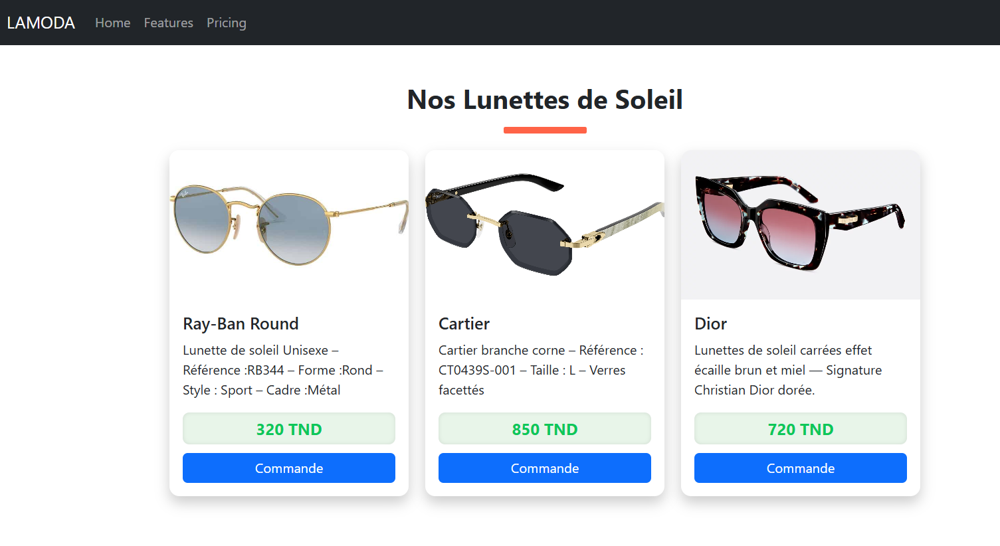

# 🕶️ Composant React — Nos Lunettes de Soleil

Ce projet présente un composant React moderne et élégant affichant une collection de **lunettes de soleil** sous forme de **cartes interactives**.  
Il est conçu avec **React-Bootstrap** et met l’accent sur un design **professionnel**, digne d’un site e-commerce.

---

## 🚀 Fonctionnalités

- 🖼️ **Affichage de produits** sous forme de cartes (images, description, prix).  
- 🎨 **Effets de survol animés** sur les cartes et les boutons.  
- 💎 **Titre stylé** avec soulignement coloré et animation fluide.  
- 📱 **Mise en page responsive** (les cartes s’adaptent selon la taille de l’écran).  
- ⚡ **Composant réutilisable et dynamique** (utilise `map()` pour parcourir la liste des produits).  

---
## 🖼️ Aperçu du rendu

Voici un aperçu du composant **Media** en action
 !
 

---

## 🧱 Technologies utilisées

- **React.js**  
- **React-Bootstrap** (pour les composants `Card` et `Button`)  
- **CSS-in-JS** (styles directement dans le fichier JS via des objets)  

---

## 📦 Installation

1. Clone ce dépôt ou copie le code du composant `Media.jsx` dans ton projet :
   ```bash
   git clone <https://github.com/Fatma1991-gif>
   cd <poject-reactcheckpoint>

Installe les dépendances nécessaires :
bash
npm install react-bootstrap bootstrap


Dans fichier index.js (ou App.js), importe le style Bootstrap :
js
import 'bootstrap/dist/css/bootstrap.min.css';
Ensuite, importe ton composant :

js
import Media from './Media';

jsx
import Menu from './Menu';
import Media from './Media';
function App() {
  return (
    <div>
      <Menu/>
      <Media/>
    </div>
  )
}

export default App


🧑‍💻 Auteur
Fatma Chenkaoui
📍 Tunisie
💬 Développeuse front-end passionnée par React, UI/UX et le design moderne.